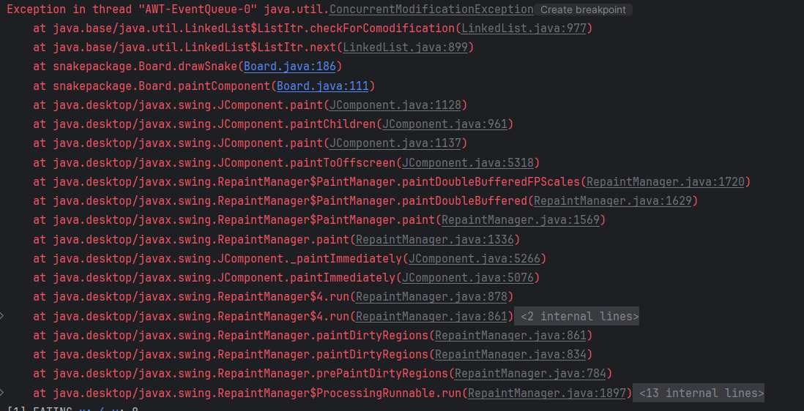
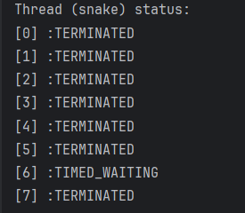
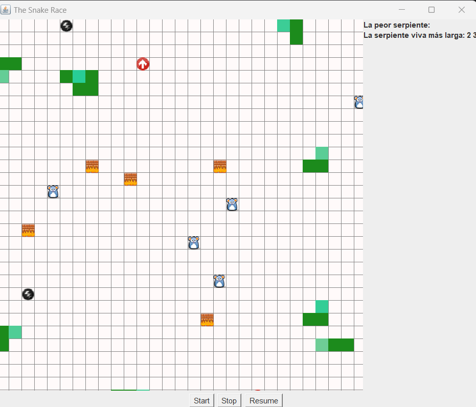

# Resolución Laboratorio 1

## Tabla de Contenido
1. [Integrantes](#integrantes)
2. [Introducción](#introducción)
3. [Procedimiento](#procedimiento)
    1. [Parte I](#Parte-i)
    2. [Parte II](#parte-ii)
4. [Soluciones](#soluciones)
5. [Conclusiones](#conclusiones)

---

## Integrantes
- Santiago Avellaneda
- Miguel Motta

---

## Introducción
En el desarrollo de software moderno, la concurrencia y la sincronización son 
fundamentales para crear aplicaciones eficientes y robustas que aprovechen al 
máximo las capacidades de los sistemas multicore actuales. Este laboratorio se 
centra en explorar y aplicar conceptos clave relacionados con la programación 
concurrente, incluyendo la identificación y manejo de condiciones de carrera, 
la implementación de esquemas de sincronización y el uso de colecciones 
sincronizadas y concurrentes.
Este laboratorio es una parte integral del curso de Arquitecturas de Software 
(ARSW) y está diseñado para proporcionar a los estudiantes las habilidades 
necesarias para enfrentar los desafíos asociados con la programación concurrente 
en el desarrollo de software de alto rendimiento.

---

## Procedimiento
---

### Parte I 
>
> 1. Descargue el proyecto
     [*PrimeFinder*](https://github.com/ARSW-ECI/wait-notify-excercise).
     Este es un programa que calcula números primos entre 0 y M
     (Control.MAXVALUE), concurrentemente, distribuyendo la búsqueda de
     los mismos entre n (Control.NTHREADS) hilos independientes.
>
>
> 2.  Se necesita modificar la aplicación de manera que cada t
      milisegundos de ejecución de los threads, se detengan todos los
      hilos y se muestre el número de primos encontrados hasta el momento.
      Luego, se debe esperar a que el usuario presione ENTER para reanudar
      la ejecución de los mismos. Utilice los mecanismos de sincronización
      provistos por el lenguaje (wait y notify, notifyAll).

### Solución
> Para resolver este ejercicio, es importante tener claro el concepto de hilo y
> los mecanismos que utilizan sus métodos:
> * [`wait()`](https://www.arquitecturajava.com/java-wait-notify-y-threads/)
> * [`notify()`](https://www.arquitecturajava.com/java-wait-notify-y-threads/)
> * [`notifyAll()`](https://www.geeksforgeeks.org/difference-between-notify-and-notifyall-in-java/)


Ya tuvimos la oportunidad de implementar hilos, sin embargo, no habíamos usado
uno de sus métodos fuera de [`join()`](https://docs.oracle.com/javase/tutorial/essential/concurrency/join.html).
A diferencia de `join()`, estos métodos deben ejecutarse en un contexto [`synchronized`](https://docs.oracle.com/javase/tutorial/essential/concurrency/syncmeth.html)
que puede declararse como un método o contenido en un método. `synchronized` es una herramienta que nos permite ejecutar código
secuencialmente en un bloque de hilos, esto nos permite alterar el comportamiento de nuestros hilos para ejecutar
tareas a priori y tener un control sobre estos. Esta declaración se hace con un objeto que funciona como
un monitor del hilo en cuestión.

Un objeto monitor es un mecanismo de sincronización que controla el acceso concurrente de un objeto (o hilo en este caso).
Con estos objetos podemos hacer uso de los métodos `wait()`, `notify()` y `notifyAll()`, teniendo en cuenta,
que los hilos deben compartir este objeto monitor en común para funcionar correctamente.

Teniendo en cuenta lo anterior, la estrategia que seguimos para resolver el ejercicio, fue basándonos en el 
concepto de cómo funcionan los hilos y la sincronización. 

Creamos un objeto final que va a funcionar cómo monitor, este objeto se lo agregamos como atributo final
a la clase `Control` y a la clase `PrimeFinderThread`

#### *Clase de Control*
```
public class Control extends Thread {
    
    // Attributes ...
    private volatile boolean paused = false;
    private final Object monitor = new Object();
    // Contructor and Methods ...
}
```

#### *Clase de PrimeFinderThread*
```
public class PrimeFinderThread extends Thread{
    // Attributes ...
    private final Control controller;
    private final Object monitor;
    // Contructor and Methods ...
}    
```

El objeto `monitor` nos permite controlar los hilos dado que es un recurso compartido
que nos permitirá establecer un bloqueo de los hilos en un estado dado.

Siguiendo con esta estrategia, podemos ver que también hay un atributo de `controller` de tipo `Controller`
esto con el fin de permitir una comunicación bidireccional entre las clases. 

El comportamiento que se encuentra en la clase de `PrimeFinderThread` ejecuta el proceso que tenía
definido previamente, pero haciendo primero una confirmación de estado sobre un atributo cambiante o 
'volátil' que nos permite confirmar que el proceso esté pausado. Esto podría evitarse si pudiéramos
garantizar que los procesos que usan el método `wait()` quedan pausados indefinidamente, sin embargo, dada la
naturaleza de Java, se pueden presentar casos extraños en los que un hilo se 'active' solo, sin haber sido
llamado con el método para activarlo `notify()` o `notifyAll()`. Por esta razón, se recomienda declarar el método `wait()` 
dentro de una sentencia `while` para garantizar un comportamiento controlado, lo hicimos de la siguiente manera:

#### *Clase de PrimeFinderThread*
```
public class PrimeFinderThread extends Thread{
    // Attributes ...
    // Contructor
    @Override
        public void run() {
            for (int i = a; i < b; i++) {
                synchronized (monitor) {
                    while (controller.isPaused()) {
                        try {
                            monitor.wait();
                        } catch (InterruptedException e) {
                            Thread.currentThread().interrupt();
                            e.printStackTrace();
                        }
                    }
                }

                if (isPrime(i)) {
                    primes.add(i);
                    System.out.println(i);
                }
            }
        }
    // More methods ...
}    
```
Cómo podemos ver, se declara `synchronized (monitor)` sabiendo qué es el objeto `monitor`. 
Además, en el ciclo `while` se hace una verificación con el controlador, si este
está en pausa, el hilo de tipo `PrimeFinderThread` ejecutará el contenido del ciclo `while` 
que detiene el mismo hilo y lo pone en espera para que otro hilo lo active.
De lo contrario determinará si el número del ciclo es primo, y de serlo, lo imprimirá.

Con esta modificación podemos establecer este comportamiento en el controlador sin 
necesidad de ejecutar el método `wait()`, sino cambiar el estado de la siguiente manera:

#### *Clase de Control*
```
public class Control extends Thread {
    // Attributes ...
    // Contructor and Methods ...
    void pauseAll(){
        synchronized (monitor) {
            paused = true;
        }
    }
}
```
Este método desencadenará que los demás hilos se pausen, pero él seguirá
en su ejecución independiente.

Ahora para reanudar los hilos, podemos aprovechar el atributo en común que comparten los
hilos que se están controlando, en un método implementando el comando `notifyAll()`:

#### *Clase de Control*
```
public class Control extends Thread {
    // Attributes ...
    // Contructor and Methods ...
    void resumeThreads(){
        synchronized (monitor){
            paused = false;
            monitor.notifyAll();
        }
    }
}
```

De esta forma, se reanudarán todos los hilos que compartan el objeto `monitor` en común.


#### Parte II
Ejercicio

1. Analice el código para entender cómo hace uso de hilos para crear un comportamiento autónomo de las N serpientes.

En el código proporcionado, cada serpiente se implementa como una instancia de una clase que extiende Thread o implementa Runnable. 
Al iniciar el juego, se crean N instancias de serpientes y se inicia su ejecución mediante la invocación del método start() en cada una. 
Esto provoca que cada serpiente ejecute su propio ciclo de vida de manera independiente y concurrente. Dentro del método run() de cada 
serpiente, se define un bucle que controla su movimiento autónomo en el tablero, actualizando su posición y verificando colisiones de 
manera periódica. Este enfoque permite que cada serpiente opere de forma independiente, simulando un comportamiento autónomo gracias 
al uso de hilos.
Además, cada serpiente accede al tablero para realizar verificaciones en las casillas y añade elementos a su cuerpo de manera concurrente.
Aunque hay que decir que presenta bastantes errores en concurrencia que analizaremos más adelante.

2. De acuerdo con lo anterior, y con la lógica del juego, identifique y escriba claramente (archivo RESPUESTAS.txt):
    - Posibles condiciones de carrera.
      - Acceso concurrente a recursos compartidos sin la debida sincronización, como la lista que contiene las posiciones de las serpientes en el tablero. 
      - Modificación concurrente de las posiciones de las serpientes en el tablero, lo que puede llevar a inconsistencias en la representación del juego.
      En alguna ejecución, presentamos que los ratones dejaron de ser 5, cuando se supone que estos se deben de regenerar al ser comidos.
      - Actualización simultánea de la interfaz gráfica por múltiples hilos sin mecanismos de control, lo que puede llevar a inconsistencias en la representación visual del juego.
   
    - Uso inadecuado de colecciones, considerando su manejo concurrente (para esto, aumente la velocidad del juego y ejecútelo varias veces hasta que se genere un error).
      - La lista enlazada no es un objeto "thread safe", por lo cual al hacer cambios de manera concurrente en ella, pueden presentarse
      inconsistencias en la representación del juego.

    - Uso innecesario de esperas activas.
      - El uso de sleep() puede llegar a dejar el hilo en espera infita, quedandose en un estado de TIME_WAITING, lo cual no es eficiente. Por otro lado, Thread.sleep() no 
      garantiza precisión exacta en el tiempo.

      - El codigo que verifica si todas las serpientes han muerto, se encuentra en un ciclo while que se ejecuta hasta que todas las serpientes hayan muerto. 
      Sin embargo, este ciclo no tiene un mecanismo de espera activa, por lo que el hilo se queda en un estado de espera activa, consumiendo recursos del sistema, quitando tiempo de 
      procesador a otros hilos de manera innecesaria.

2. Identifique las regiones críticas asociadas a las condiciones de carrera, y haga algo para eliminarlas. Tenga en cuenta que se debe sincronizar estríctamente LO NECESARIO. En su documento de respuestas indique, la solución realizada para cada ítem del punto 2. Igualmente tenga en cuenta que en los siguientes puntos NO se deben agregar más posibles condiciones de carrera.
   - Variables compartidas:
     - El tablero.
     - Los arreglos de food, walls, jumps y boosts. Que representan las casillas en las que se pueden encontrar dos o más serpientes al mismo tiempo disputando por ellas.
     - La modificación en el cuerpo de la serpiente.

3. Como se puede observar, el juego está incompleto. Haga los ajustes necesarios para que a través de botones en la interfaz se pueda Iniciar/Pausar/Reanudar el juego: iniciar el juego no se ha iniciado aún, suspender el juego si está en ejecución, reactivar el juego si está suspendido. Para esto tenga en cuenta:
    * Al pausar (suspender) el juego, en alguna parte de la interfaz (agregue los componentes que desee) se debe mostrar:
        - La serpiente viva más larga.
        - La peor serpiente: la que primero murió.



## Soluciones
1. Condiciones carrera
Para solucionar ello, se decidieron sincronizar los metodos con monitor la región crítica de la lista de serpientes, la lista de ratones y la lista de posiciones de las serpientes.
```
private void checkIfTurboBoost(Cell newCell) {
        synchronized (Board.turbo_boosts) {
            if (Board.gameboard[newCell.getX()][newCell.getY()].isTurbo_boost()) {
                // get turbo_boost
                for (int i = 0; i != Board.NR_TURBO_BOOSTS; i++) {
                    if (Board.turbo_boosts[i] == newCell) {
                        Board.turbo_boosts[i].setTurbo_boost(false);
                        Board.turbo_boosts[i] = new Cell(-5, -5);
                        hasTurbo = true;
                    }
                }
                System.out.println("[" + idt + "] " + "GETTING TURBO BOOST "
                        + newCell.toString());
            }
        }
    }

    private void checkIfJumpPad(Cell newCell) {
        synchronized (Board.jump_pads) {
            if (Board.gameboard[newCell.getX()][newCell.getY()].isJump_pad()) {
                // get jump_pad
                for (int i = 0; i != Board.NR_JUMP_PADS; i++) {
                    if (Board.jump_pads[i] == newCell) {
                        Board.jump_pads[i].setJump_pad(false);
                        Board.jump_pads[i] = new Cell(-5, -5);
                        this.jumps++;
                    }
                }
                System.out.println("[" + idt + "] " + "GETTING JUMP PAD "
                        + newCell.toString());
            }
        }
    }

    private void checkIfFood(Cell newCell) {
        Random random = new Random();
        synchronized (Board.food) {
            if (Board.gameboard[newCell.getX()][newCell.getY()].isFood()) {
                // eat food
                growing += 3;
                int x = random.nextInt(GridSize.GRID_HEIGHT);
                int y = random.nextInt(GridSize.GRID_WIDTH);

                System.out.println("[" + idt + "] " + "EATING "
                        + newCell.toString());
                SnakeApp.getApp().updateLongestSnake();
                for (int i = 0; i != Board.NR_FOOD; i++) {
                    if (Board.food[i].getX() == newCell.getX()
                            && Board.food[i].getY() == newCell.getY()) {
                        Board.gameboard[Board.food[i].getX()][Board.food[i].getY()]
                                .setFood(false);

                        while (Board.gameboard[x][y].hasElements()) {
                            x = random.nextInt(GridSize.GRID_HEIGHT);
                            y = random.nextInt(GridSize.GRID_WIDTH);
                        }
                        Board.food[i] = new Cell(x, y);
                        Board.gameboard[x][y].setFood(true);
                    }
                }
            }
        }
    }

    private void checkIfBarrier(Cell newCell) {
            synchronized (Board.gameboard) {
                if (Board.gameboard[newCell.getX()][newCell.getY()].isBarrier()) {
                    // crash
                    System.out.println("[" + idt + "] " + "CRASHED AGAINST BARRIER "
                            + newCell.toString());
                    snakeEnd = true;
                }
            }
        }
    }
```
2. Uso inadecuado de colecciones
Se sustituyo la lista enlazada por un `CopyOnWriteArrayList` que es una lista que permite la modificación de la lista mientras se itera sobre ella. Es decir, es "thread safe", concurrente.
```
import java.util.concurrent.CopyOnWriteArrayList;
public class Snake extends Observable implements Runnable {
    // Attributes ...
    private CopyOnWriteArrayList<Cell> snakeBody = new CopyOnWriteArrayList<>();
    // Contructor and Methods ...
}
```
3. Uso innecesario de esperas activas
Para evitar el while(ture), se implemento un mecanismo de espera activa con un `CountDownLatch` que permite que el hilo principal espere a que todos los hilos hayan terminado de ejecutar.
```
import java.util.concurrent.CountDownLatch;

public class SnakeApp extends JFrame {
    // Attributes ...
    private CountDownLatch latch;
    // Contructor and Methods ...
}  

public class Snake extends Observable implements Runnable {
    // Attributes ...
    private CountDownLatch latch;
    // Contructor and Methods ...
}  
```

## Conclusiones
1. Importancia de la sincronización en la programación concurrente: 
A través del uso de los métodos wait(), notify() y notifyAll(), logramos controlar la ejecución de múltiples hilos, evitando condiciones de carrera y 
garantizando un comportamiento predecible del programa. 
2. Uso eficiente de monitores: La implementación de un objeto compartido como monitor nos permitió pausar y reanudar la ejecución de los hilos de manera 
ordenada. Esto facilitó la sincronización y evitó problemas de concurrencia en la búsqueda de números primos. 
3. Buenas prácticas en el uso de wait() y notify(): Implementamos un control adicional mediante una variable volatile en combinación con synchronized para 
asegurar que los hilos no se reanudaran involuntariamente debido a interrupciones inesperadas. 
4. Identificación y mitigación de condiciones de carrera: Al analizar el código de las serpientes, se identificaron múltiples regiones críticas 
relacionadas con la modificación concurrente de estructuras de datos compartidas. La aplicación de sincronización selectiva permitió mejorar la estabilidad y la consistencia del juego. 
5. Optimización del acceso a colecciones compartidas: El uso de estructuras de datos no seguras para la concurrencia generó problemas de ConcurrentModificationException. 
Esto evidenció la necesidad de emplear colecciones concurrentes o sincronizar adecuadamente su acceso. 
6. Impacto de las esperas activas en el rendimiento: Se evidenció que el uso de Thread.sleep() puede llevar a problemas de eficiencia y consumo 
innecesario de recursos. Reemplazar estas técnicas por mecanismos de sincronización como wait() ayudó a optimizar la ejecución del programa. Métricas que son importantes en servicios en l nube,
puesto que por el uso del procesador es que se realiza el cobro.
7. Lecciones aprendidas y aplicaciones futuras: Este laboratorio reforzó la comprensión de los principios de concurrencia en Java y su aplicación 
en el desarrollo de software de alto rendimiento. Las estrategias implementadas pueden extrapolarse a escenarios reales donde la programación concurrente sea 
esencial, como en servidores web, sistemas de simulación y procesamiento paralelo de datos.